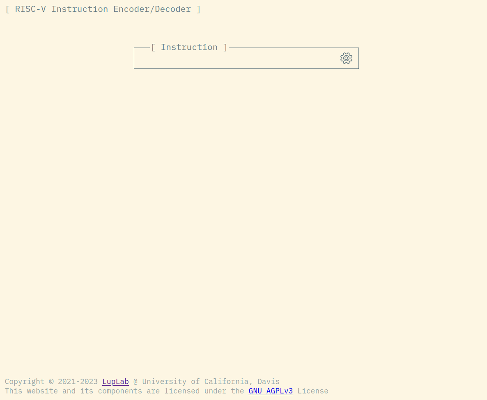

# rvcodec.js

## Introduction

**rvcodec.js** is a RISC-V instruction encoder/decoder available at
<https://luplab.gitlab.io/rvcodecjs/>.

**rvcodec.js** conveniently shows how each token of the assembly instruction is
encoded as part of the binary representation.

## Usage

In the search box, type in a RISC-V instruction. You can input instructions in
their *(decoded)* assembly form (such as `addi x2, x10, 897`) or their
*(encoded)* numerical form (such as `0x38150113`). For assembly instructions, a
helpful drop-down menu can perform some auto-completion and/or show you their
canonical forms.

Once you press Enter, the instruction you typed in will be converted in all
possible formats. You can use your mouse cursor to hover over the different
colored fields to see how the assembly and binary representations match.

The settings wheel inside the search box gives you access to a couple of
parameters:

- The `ABI` toggle makes the converted assembly representation use either the
  numerical register names or the ABI register names (e.g., `x2` vs `sp`).
- The `ISA` menu allows you to force a certain RISC-V ISA. For example,
  selecting ISA `RV32I` will make certain instructions fail since they don't
  exist for that particular ISA (e.g., `addiw x2, x10, 897`).

## Support

Supported instruction sets and extensions:

- RV32I instruction set
- RV64I instruction set
- RV128I instruction set
- Rest of GC extensions
    - Zifencei instruction set
    - Zicsr instruction set
    - M (multiplication/division) instruction set
    - A (atomic) instruction set
    - F (single-precision floating point) instruction set
    - D (double-precision floating point) instruction set
    - Q (quad-precision floating point) instruction set
    - C (compressed) instruction set
- Privileged instruction set *(partially)*

## Contributing

### Run locally

- Clone this repo: `$ git clone git@gitlab.com:luplab/rvcodecjs.git`
- Install dependencies: `$ npm install`
- Make changes
    * The encoding/decoding logic is in directory `core`
    * The web user interface is in directory `web-ui`
- Run testsuite to avoid any regressions: `$ npm test`
- Open website locally to test UI: `$ npm run open`

### Roadmap

This project is now in semi-maintenance mode. The support for all base
instruction sets (`32I/64I/128I`) and the most common extensions
(`MAFDQC_Zifencei_Zicsr`) were added, and the UI/UX currently feels fairly
stable.

If you'd like to contribute something new, or see opportunities for
improvements, please contact us.

## Credit and license

**rvcodec.js** is developed by the [LupLab](https://luplab.cs.ucdavis.edu/) at
UC Davis.

**rvcodec.js** is released under the [GNU Affero General Public License
v3.0](https://www.gnu.org/licenses/agpl-3.0.en.html).
